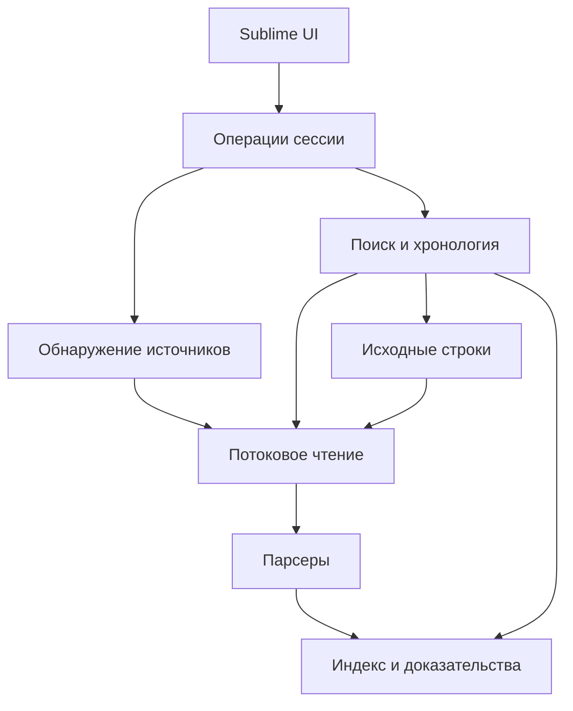

# Архитектура RED Virt Log Viewer

> Статус: этап 4 реализован (Timeline выбранной ВМ, Events Around, journal_year + offset). Хосты, Engine-сущности и фильтры узла/уровня — вне объёма. Изменения решений необходимо отражать здесь вместе с изменением кода.

## 1. Назначение и границы

RED Virt Log Viewer — локальный диагностический навигатор по распакованным сборам РЕД Виртуализации с интерфейсом Sublime Text 4.

Основной сценарий: обнаружить источники → найти объект по имени или UUID → выбрать записи → построить хронологию → открыть оригинальный текст.

Система работает с файлами. Подключение к Engine, базе данных или хостам не требуется. Диагностические выводы о причинах инцидента и автоматическая распаковка контейнеров сборов не входят в MVP. Отдельные сжатые логи gzip/xz поддерживаются.

Минимальная сборка Sublime Text: **4050** (Python 3.8 plugin host). Проверка среды разработки: сборка **4200**. Файл `.python-version` содержит `3.8`. В plugin_host 3.8 доступны `sqlite3`, `gzip` и `lzma`. Устаревание файла в индексе: `size + mtime_ns + parser_id + parser_version + encoding`. Полный хеш содержимого в этапе 2 не считается.

## 2. Слои и зависимости

| Слой | Ответственность | Допустимые зависимости |
| --- | --- | --- |
| `ui` | Команды, выбор объектов и фильтров, результаты, открытие источников | Sublime API и публичные операции ядра |
| `core` | Сессии, обнаружение, чтение, индекс, поиск, объекты, время, фоновые задачи | Стандартная библиотека, проверенные зависимости, реестр парсеров |
| `parsers` | Распознавание форматов, границы записей, извлечение полей и доказательств | Модели и контракты; без доступа к UI и SQLite |

`core` и `parsers` не импортируют `sublime`. Парсеры не открывают файлы, не запускают команды и не записывают индекс: получают строки от читателя и возвращают структурированные результаты.

Модели и контракты не зависят от конкретных парсеров. Реестр форматов подключается на уровне оркестрации, чтобы избежать циклических импортов.

## 3. Структура модулей

| Путь | Назначение |
| --- | --- |
| `RedVirtLogViewer.py` | Регистрация команд и обработчиков жизненного цикла Sublime |
| `ui/commands.py` | Вызов операций ядра и проверка пользовательского ввода |
| `ui/panels.py` | Выбор сессии, объектов и фильтров |
| `ui/results.py` | Представление результатов; соответствие строк вкладки идентификаторам записей |
| `core/models.py` | Модели данных и ссылки на источники |
| `core/session.py` | Состав сессии, настройки и переключение активной сессии |
| `core/discovery.py` | Обход каталогов, определение источников, предварительная классификация |
| `core/readers.py` | Чтение обычного текста, gzip и xz с сохранением номеров строк |
| `core/index.py` | Схема SQLite, транзакции и поколения индекса |
| `core/entities.py` | Объекты, наблюдения имён и доказательства связей |
| `core/search.py` | Буквальный поиск по файлам (не Find Object) |
| `core/timeline.py` | `events_in_window` / `events_around` по published SQLite; интервал `[start, end)` |
| `core/source.py` | Получение оригинальных строк и проверка актуальности ссылок |
| `core/jobs.py` | Очередь работ, прогресс, отмена и доставка результатов |
| `parsers/base.py` | Контракт распознавания и разбора |
| `parsers/engine.py` | Engine |
| `parsers/vdsm.py` | VDSM |
| `parsers/qemu.py` | QEMU, включая блоки запуска |
| `parsers/journal.py` | Текстовые выгрузки journal |
| `parsers/generic.py` | Резервный режим для текстовых файлов |
| `tests/fixtures/` | Минимальные обезличенные образцы |

Не создавать отдельные классы ВМ и хоста без необходимости. Для MVP достаточно общей модели объекта с типом.

## 4. Сессия, сбор и узел

Сессия — контекст одного обращения. Идентификатор и каталог SQLite считаются по `realpath` корней (`~/.cache/red-virt-log-viewer/roots/<ключ>/`). Окно Sublime с папками в сайдбаре само становится сессией; результаты и фоновые задачи содержат этот идентификатор.

Различать следующие понятия:

| Понятие | Смысл |
| --- | --- |
| Каталог сбора | Корень одного набора полученных файлов |
| Узел | Машина, к которой относятся данные; может оставаться неопределённой |
| Компонент | Engine, VDSM, QEMU, journal или неизвестный |
| Файл | Конкретный источник с относительным путём и отпечатком |
| Запись | Строка либо логический многострочный блок |

Несколько сборов одного узла сохраняются отдельно. Разные обращения не объединяются автоматически. Каталог, содержащий Engine, не исключает наличия VDSM или других компонентов. Роль машины не выводится только из названия папки.

Имя узла из `info.txt`, пути или сообщения сохраняется как наблюдение с происхождением. До подтверждения соответствия нельзя автоматически склеивать короткие имена, FQDN и UUID узлов.

## 5. Обнаружение и чтение

### 5.1. Обход каталогов

Поддерживаемые ориентиры: `rv_info/logs/`, `log/`, `var/log/`, `rv_info/journalctl/`. Они помогают классификации, но не являются единственно допустимыми путями.

Обход выполняется с исключением собственного кеша и служебных каталогов. По умолчанию символические ссылки не обходятся, чтобы исключить циклы и выход за выбранные корни. Пути с пробелами и Unicode обрабатываются как пути, а не как текст командной строки.

Для файла независимо учитываются:

- доступность чтения и размер;
- тип сжатия;
- вероятность текстового содержимого;
- предполагаемый компонент;
- распознанный формат и его версия;
- состояние обработки.

Пустой файл получает статус `empty`. Неподдерживаемый архив — `unsupported_container`. Бинарный источник — `unsupported_binary`. Нельзя считать их успешно проиндексированными текстовыми журналами.

### 5.2. Распознавание формата

Путь даёт подсказку, ограниченная начальная выборка содержимого подтверждает формат. Одна пустая строка или заголовок перед журналом не должны исключать файл.

Число просмотренных строк и байтов ограничивается настройками. Если формат не определён в пределах выборки, файл остаётся доступным в резервном текстовом режиме. Пользователь может явно выбрать формат источника.

Шаблон должен распознавать записи, а не просто наличие временной метки. Перекрывающиеся распознаватели разрешаются детерминированно по специфичности и подтверждённым признакам. Неоднозначность отражается в статусе.

### 5.3. Читатель

Читатель выдаёт номер физической строки, декодированный текст и позицию, если формат доступа позволяет её сохранить. Нумерация начинается с 1. Для gzip/xz номера относятся к распакованному содержимому.

Оригинальные байты не изменяются. Кодировка источника хранится в метаданных; замены некорректных символов фиксируются. При смене кодировки индекс и позиции пересчитываются. UTF-8 является первоначальным вариантом, но отсутствие ошибок чтения не доказывает правильный выбор кодировки.

Длинные строки и записи обрабатываются с ограничением буфера. В индекс может попасть сокращённое представление, но ссылка должна позволять получить исходник. Усечение отмечается; поиск не должен незаметно ограничиваться сокращённым представлением. При достижении жёсткого лимита операция возвращает признак неполноты.

## 6. Контракт парсера

Каждый парсер имеет `parser_id`, версию и две операции:

1. Оценить формат по метаданным и ограниченной выборке строк.
2. Преобразовать поток строк в записи, наблюдения объектов и сообщения о проблемах разбора.

Парсер сохраняет состояние только внутри одного файла. На границе файла или при отмене состояние сбрасывается. В конце файла незавершённый многострочный блок возвращается с признаком неполноты.

Запись содержит:

- идентификатор файла и поколение индекса;
- начальную и конечную физические строки;
- исходную временную метку и результат её разбора;
- компонент, уровень и доступные поля формата;
- ограниченное краткое представление;
- найденные идентификаторы с типом и основанием;
- признаки продолжения, усечения или ошибки разбора.

Парсер не определяет причину инцидента. При отсутствии распознанного уровня используется неизвестный уровень; слово `error` в произвольном тексте не становится автоматически уровнем ERROR.

### Особенности форматов

| Формат | Обязательное поведение |
| --- | --- |
| Engine | Поля заголовка, явные имена и UUID, продолжения и стеки исключений |
| VDSM | Время, уровень, поток/компонент, `vmId` и другие типизированные поля |
| QEMU | Заголовки событий, многострочный запуск, `-name guest=…`, `-uuid …` и hostname |
| journal | UTC только если заданы оба `journal_year` и `journal_utc_offset`; иначе issue, не «сегодня» |
| generic | Поиск исходного текста и переходы; отсутствие специализированных полей не скрывает файл |

Командную строку QEMU нельзя исполнять или передавать оболочке. Она разбирается как данные внутри конкретного блока запуска.

## 7. Объекты и доказательства

### 7.1. Идентичность

Для подтверждённого объекта ключ — сессия, тип объекта и канонический UUID. Внутренний числовой идентификатор нужен для ссылок в SQLite. Объект без UUID допускается как неразрешённое наблюдение и не объединяется с другими только по имени.

Идентификатор неизвестного назначения хранится отдельно. UUID домена хранения, диска или задачи нельзя автоматически считать UUID ВМ.

### 7.2. Источники связи

Допустимые основания:

- известный формат явно связывает имя и UUID;
- один блок запуска QEMU содержит оба параметра;
- структурированный источник явно задаёт соответствие;
- пользователь создал явное соответствие, сохранённое как ручное.

Для каждого основания хранится ссылка на запись или диапазон строк. Совместное появление имён и UUID рядом без семантики формата недостаточно.

Дата наблюдения имени не доказывает период его действительности. Хранить наблюдение «это имя встречалось с этим UUID в это время», а не выдуманный интервал существования имени.

### 7.3. Поиск объекта

Поиск по имени возвращает кандидатов с типом, UUID и происхождением имени. Одинаковые имена с разными UUID представлены отдельно. После выбора основным критерием становятся подтверждённые типизированные упоминания UUID.

Совпадения только по имени сохраняются как отдельный вид результата и не объявляются подтверждёнными событиями выбранного UUID. Это особенно важно для повторно использованных и исторических имён.

Первое практическое правило MVP: связь из блока запуска QEMU → выбранная ВМ → записи VDSM с её явным `vmId`.

## 8. Время

Хранить нормализованное время как целое число микросекунд UTC, исходную строку и сведения о точности. Отсутствующая доля секунды не означает реальную микросекундную точность события.

Результат разбора включает:

| Поле | Назначение |
| --- | --- |
| `timestamp_raw` | Исходная временная метка |
| `timestamp_utc_us` | Нормализованное время либо NULL |
| `time_basis` | Явное время, настройка источника, подтверждённое восстановление или неизвестно |
| `precision` | Точность исходной метки |
| `time_issue` | Причина неоднозначности или отсутствия полного времени |

Явный пояс имеет приоритет. Форматы `+10`, `+0800`, `+03:30` и `Z` проверяются отдельно; парсер не должен принимать только корректный префикс повреждённой метки.

Если пояс отсутствует, требуется настройка источника либо подтверждённое правило. Год в journal не восстанавливается из даты компьютера или mtime архива. Пользователь задаёт оба `journal_year` и `journal_utc_offset` в настройках плагина; смена ключа `time_settings` помечает journal-файлы stale. Один год на сессию: переход `Jan` после `Dec` в том же дампе не угадывается. Без обоих полей `timestamp_utc_us` остаётся NULL.

Сортировка: нормализованное время, затем стабильный идентификатор файла и номер строки. Порядок при равных метках технический и не доказывает причинную последовательность событий.

Интервалы запросов определяются как `[начало, конец)`. Для записей без времени показывается отдельная группа и счётчик; они доступны текстовому поиску. Фильтр времени должен явно сообщать об исключении таких записей.

Смена временных настроек запускает обновление соответствующих данных индекса. Нельзя подменять новый запрос интервалом из кеша.

## 9. SQLite-индекс

Схема ниже логическая; окончательный DDL фиксируется вместе с реализацией. Индекс является производным и может быть перестроен из исходников.

| Таблица | Основные данные |
| --- | --- |
| `session_meta` | Версия схемы, настройки, поколение сессии |
| `bundles` | Корни сборов и их идентификаторы |
| `files` | Относительный путь, сжатие, размер, mtime, парсер и статус |
| `file_generations` | Поколения обработки файла и признак завершённости |
| `events` | Файл/поколение, время, уровень, строки и краткое представление |
| `entities` | Тип объекта, канонический UUID и статус разрешения |
| `entity_names` | Наблюдения имён, время и доказательство |
| `event_entities` | Типизированные упоминания объекта в записи с основанием |
| `identifiers` | Сырые идентификаторы (QEMU launch, VDSM vmId) и их позиции |
| `index_issues` | Ошибки чтения/разбора, пропуски и усечения |

Таблицы `nodes` и `sources` в этапе 3 не создаются.

Индексы запросов: время записи; файл/поколение/строка; тип/UUID объекта; поисковое представление имени; объект/запись. UUID уникален только в сочетании с типом и сессией. Имена не имеют ограничения уникальности.

Запросы параметризованные. Парсеры не исполняют SQL. Оригинальные тексты всех журналов не копируются в SQLite.

### Актуальность и публикация

- Файл сопоставляется по корню сбора и относительному пути.
- Размер и `mtime_ns` служат быстрой проверкой изменений; отпечаток содержимого даёт дополнительную проверку. Одних размера и mtime недостаточно, чтобы гарантировать неизменность.
- Полный хеш можно вычислять в отдельном проходе, а для сжатых файлов — по потоку исходных байтов при подходящей реализации читателя. Выбранный вариант и его стоимость документируются.
- Версия парсера, схемы, кодировки и временных настроек входят в признаки актуальности.
- Новый разбор пишется отдельным поколением пакетами. Завершённое поколение публикуется атомарно.
- Отменённое поколение не выдаётся за полный индекс. Предыдущее поколение изменённого файла помечается устаревшим.
- Перед открытием результата проверяется актуальность ссылки; при изменении источника пользователь получает сообщение и действие переиндексации.

## 10. Поиск и хронология

### Буквальный текст

Поиск идёт по полному исходному тексту, включая продолжения записей, а не только по краткому представлению SQLite. Режим по умолчанию — буквальная подстрока с явно заданной чувствительностью к регистру. Выделенный текст не интерпретируется как регулярное выражение.

Для индексированных источников совпадение связывается с записью. Для generic-файлов допустим результат «файл + строка». Контекст загружается по запросу.

### Объекты

Find Object читает опубликованные поколения индекса (`core/entities.py`): точный UUID или подстрока наблюдавшегося имени. Кандидаты не сливаются по имени. События объекта — только явные `vmId` / qemu `-uuid`. Идентификаторы в индексе — не «найденная причина». Если индекс пуст или неполон, это показывается явно; вымышленная ВМ не создаётся.

### Выдача

Результаты возвращаются страницами с курсором. Курсор содержит поколение запроса и последний ключ сортировки. Изменение фильтров или поколения индекса сбрасывает курсор. Отображение первых N записей не должно создавать впечатление полной выдачи.

Хронология хранит и сортирует только реальные записи. Пустые секунды не материализуются. Записи из разных файлов не удаляются автоматически как дубликаты: возможное дублирование сохраняется с происхождением.

## 11. Переход к источнику

Каждый результат несёт `SourceRef`: сессия, сбор, файл, поколение, диапазон строк и необязательная позиция в потоке.

Для обычного файла доступного размера можно открыть файл в Sublime на нужной строке. Для большого или сжатого файла открывается отдельная вкладка с фрагментом, абсолютным путём источника, исходными номерами строк и возможностью загрузить соседний контекст.

Для gzip/xz переход по номеру строки может потребовать чтения от начала. MVP должен поддерживать отмену этой операции. Полная распаковка не является обязательным условием открытия результата.

Временные фрагменты не заменяют оригинал. Буфер с фрагментом доступен только для чтения. Лимиты памяти, размера фрагмента и дискового кеша задаются настройками и показываются при достижении ограничений.

## 12. Фоновые операции и жизненный цикл

MVP использует управляемую очередь тяжёлых задач с одним активным исполнителем на сессию и отдельными соединениями SQLite для нужных потоков. Нельзя передавать одно SQLite-соединение между потоками без обоснованной политики.

Взаимодействие с представлениями Sublime выполняется через предусмотренные API механизмы и доставку обновлений в UI. Тяжёлый цикл обработки не выполняется в обработчике команды редактора.

Каждая задача имеет идентификатор, поколение запроса и токен отмены. Отмена проверяется между порциями чтения, распаковки и записи. Устаревший результат не обновляет вкладку после смены сессии, фильтра или закрытия окна.

При выгрузке плагина запрашивается отмена задач и освобождаются дескрипторы. Блокирующее ожидание завершения в UI недопустимо. Степень отзывчивости и влияние CPU-нагрузки проверяются в реальном Sublime; потоки сами по себе не гарантируют отсутствие задержек.

Фоновые задачи отдают прогресс по файлам и обработанным байтам/строкам. Для сжатого потока не показывать точный процент распакованных данных, если полный объём неизвестен.

## 13. Настройки и ограничения ресурсов

Настройки разделяются на общие и настройки сессии/источника. Минимальный набор:

- каталог кеша и лимит его объёма;
- размер страницы результатов и контекста;
- ограничения выборки для распознавания;
- кодировка и правила времени для источника;
- ограничения буферов строки/записи;
- исключения обхода каталогов.

Числовые значения по умолчанию выбираются после измерений на доступных образцах и большом сборе. Не объявлять подтверждённую поддержку многогигабайтных наборов по проверке небольших фрагментов.

Кеш не размещается внутри клиентского сбора. Автоматическая очистка удаляет только принадлежащие плагину данные. Активные файлы кеша не удаляются другой задачей.

## 14. Использование upstream

Источник: [ovirt-log-analyzer, ad6179a6622e49bc4f1682c16486555c04f29edb](https://github.com/mz-pdm/ovirt-log-analyzer/tree/ad6179a6622e49bc4f1682c16486555c04f29edb).

Переиспользовать только проверенные фрагменты, прежде всего шаблоны Engine/VDSM. Для каждого переноса фиксировать исходный файл, коммит, лицензию и изменения в `THIRD_PARTY_NOTICES.md`.

Не переносить архитектуру CLI целиком, `pickle`-кеш, группировку объектов по имени, определение формата одной строкой, молчаливое восстановление старых фильтров и эвристическое скрытие частых сообщений.

Наблюдения по прежним тестам: шаблоны Engine/VDSM подходят предоставленным строкам; старые функции извлечения объектов не нашли связь `-name`/`-uuid` из QEMU. Поэтому разбор блока запуска реализуется и проверяется отдельно.

## 15. Проверка архитектуры

| Группа | Критерий |
| --- | --- |
| Reader | Одинаковый текст и нумерация для исходника и его gzip/xz-копий; корректное поведение на повреждении |
| Парсеры | Заголовок до первой записи, многострочные блоки, неизвестные строки, EOF внутри записи |
| Объекты | Связь QEMU → UUID → VDSM; одноимённые объекты разделены; происхождение имени сохранено |
| Время | Пояса с разными форматами, отсутствие пояса/года, переход года, одинаковые метки |
| Индекс | Изменение файла и настроек, отменённое поколение, повторное открытие, отсутствие подмены фильтров |
| Поиск | Совпадение в продолжении записи, буквальные спецсимволы, полная проверка текста вне сокращённого представления |
| Навигация | Исходные строки обычного и сжатого файла, Unicode и пробелы в пути, устаревшая ссылка |
| UI | Отмена, закрытие вкладки, смена фильтра, неполная выдача, отсутствие зависания на большом источнике |

Тестовые фикстуры обезличиваются согласованно: одно и то же имя/UUID заменяется одинаково во всех связанных файлах. Клиентские сборы не коммитятся.

Проверки функций на образцах, интеграционные проверки ядра и ручные проверки внутри Sublime учитываются отдельно. Текущие образцы QEMU за май и VDSM за август годятся для проверки идентификатора, но не подтверждают восстановление одного инцидента.

## 16. Последовательность реализации

1. Уточнить окружение Sublime и проверить базовые зависимости. **Сделано (ST4 4050+/Python 3.8).**
2. Реализовать модели, discovery, readers и поиск с переходом к строке. **Сделано (этап 1).**
3. Добавить парсеры и обработку многострочных записей. **Сделано (этап 2).**
4. Добавить индекс с поколениями, состояниями и отменой. **Сделано (этап 2).**
5. Реализовать доказательства QEMU и поиск ВМ в VDSM. **Сделано (этап 3, Find Object).**
6. Нормализация времени journal по настройкам и хронология. **Сделано (этап 4).** Объекты Engine — позже.
7. Проверить UI, лимиты ресурсов, упаковку и пользовательскую документацию.

SQLite: `session_meta` (в том числе `time_settings`), `bundles`, `files`, `file_generations`, `events`, `identifiers`, `index_issues`, `entities`, `entity_names`, `event_entities`. Таблиц `nodes`/`sources` нет. Буквальный поиск читает файлы (`core/search.py`). Find Object не переписывается. Запросы Timeline идут в worker через `JobQueue` по published поколениям.
